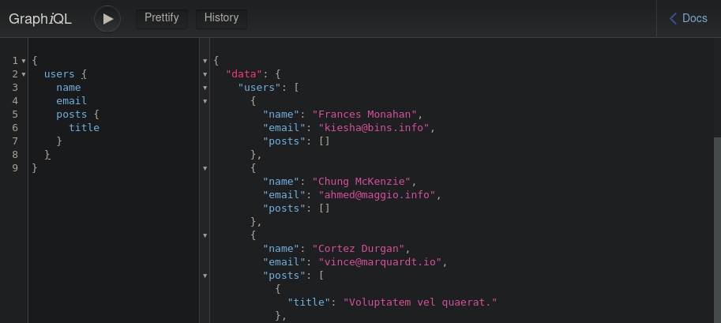
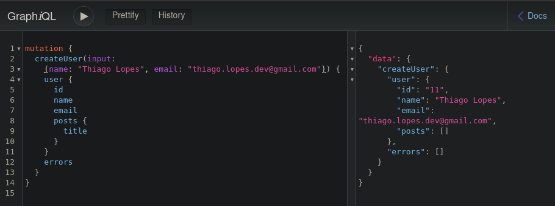

# GraphQL API with Ruby on Rails

### This is a simple API with Fake data using Ruby on Rails
- Ruby version: 2.7.2
- Rails version: 6.0.3
- Puma version: 4.1

more information about the setup, please check the [Gemfile](Gemfile).

#### Result:
 

## 🤔 Como contribuir

Se quiser contribuir para esse repositório aqui, seja corrigindo algum problema, adicionando comentários ou melhorando a documentação, você pode seguir esse tutorial abaixo:

- Faça [um fork](https://help.github.com/pt/github/getting-started-with-github/fork-a-repo) desse repositório;
- Entre no seu perfil no GitHub e faça um clone do repositório que você fez um *fork*;
- Crie uma *branch* com a sua alteração: `git checkout -b minha-alteracao`;
- Faça as alterações necessárias no código ou na documentação;
- Faça *commit* das suas alterações: `git commit -m 'feat: Minha nova feature'`;
- Faça *push* para a sua *branch*: `git push origin minha-alteracao`;
- Agora é só abrir a sua *pull request* no repositório que você fez o *fork*;

Depois que o *merge* da sua *pull request* for feito, você pode deletar a sua *branch*.

Feito com ♥ by Thiago Lopes